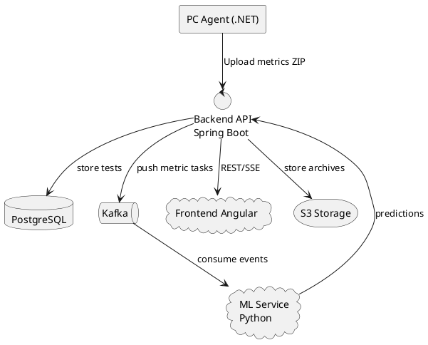

# Архитектура

## Общий обзор

## Пояснения
- **AG** собирает метрики и отправляет архив теста (ZIP).
- **BE** принимает тест, сохраняет артефакты и публикует задачу обработки.
- **Kafka** используется как транспорт для асинхронной обработки.
- **ML** рассчитывает предсказания/инсайты и возвращает их в Backend.
- **FE** отображает результаты пользователю, включая live‑метрики (SSE).
