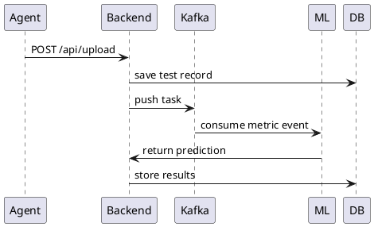

# Backend (Spring Boot 3.5.5)

## Стек используемых технологий

- Java 21
- Spring Boot 3.5
- Lombok

## Модули
- REST API
- Auth (Keycloak + JWT)
- Processing Queue (Kafka)
- Storage PostgreSQL
- Recommendation Engine
- S3 Storage

## API Sequence

