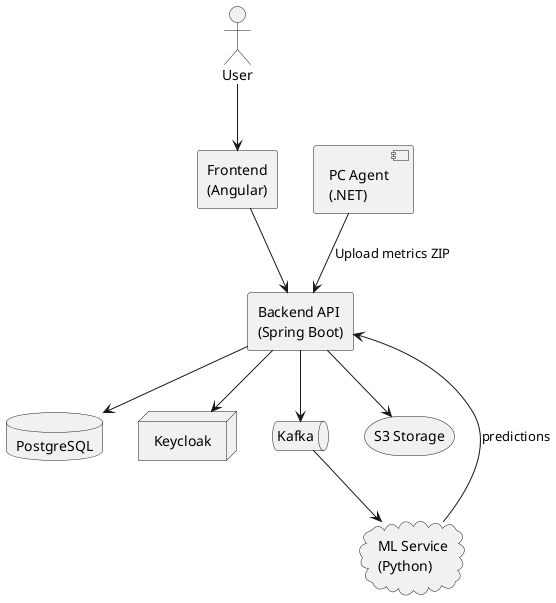
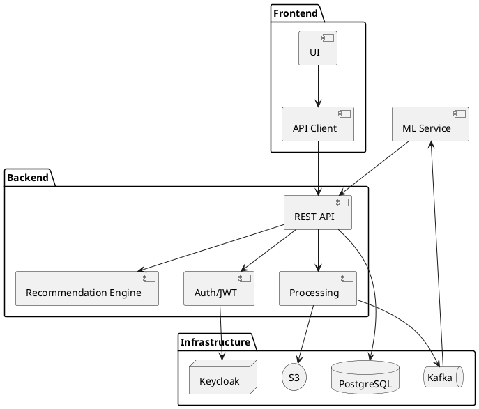
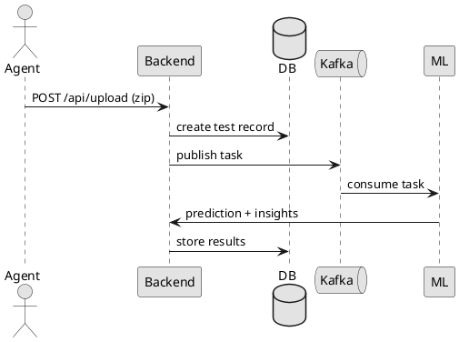
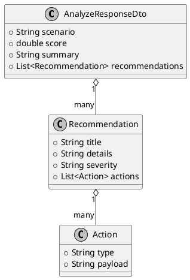

# UML Diagrams

Диаграммы рендерятся из PlantUML локально в CI (Java + Graphviz).

## 1) System context

## 2) Component diagram (high level)

## 3) Sequence: upload test

## 4) Class: AnalyzeResponse (draft)

