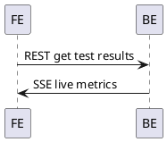

# Frontend (Angular 20)

## Стек используемых технологий

- TypeScript
- Angular 20

## Основные экраны
- Тестирование (live)
- Результат теста
- История тестов
- Подбор комплектующих
- Профиль

## Поток данных

