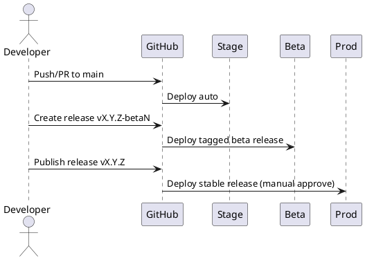

# Infrastructure

Документ описывает общую архитектуру инфраструктуры проекта **Project 2025 (PcBench)**, включая облачную среду, CI/CD пайплайны, кластеры Kubernetes, работу трёх контуров (stage / beta / prod), систему логирования, мониторинга и стратегии выката.

---

# 1. Облачная платформа

Сервис развёрнут в **Timeweb Cloud** и использует следующие компоненты:

- Managed Kubernetes Cluster
- Timeweb Container Registry
- Object Storage (S3-совместимый)
- Managed PostgreSQL
- Managed Redis
- Балансировщики L7 (Ingress)
- Отдельные KubeConfig для каждого контура

---

# 2. Логическая схема инфраструктуры

```text
Timeweb Cloud
└── Managed Kubernetes Cluster
    ├── Namespace p25-stage
    ├── Namespace p25-beta
    └── Namespace p25-prod

Timeweb Container Registry
S3 Storage (stage / beta / prod)
PostgreSQL DB (отдельные кластеры)
Redis (отдельные кластеры)
```

---

# 3. Контуры окружений

Проект использует **трёхконтурную модель деплоя**, обеспечивающую плавный путь изменений от разработки до продакшена.

## 3.1 Контур Stage

Окружение для внутренней разработки.

- Автодеплой всех пушей в `main`
- Самые свежие изменения
- Возможны нестабильные состояния
- Отдельная база PostgreSQL
- Отдельный S3 бакет
- 100% доступно только разработчикам

### Stage архитектура

```text
Namespace: p25-stage
- backend (3 replicas)
- ml-service (1 replica)
- frontend (SPA + nginx)
- redis (single)
- postgresql (single instance)
```

---

## 3.2 Контур Beta

Публичный тестовый контур для ограниченного числа пользователей.

- Деплой при релизах вида `vX.Y.Z-betaN`
- Полная изоляция от stage
- Отдельные секреты и конфиги
- Частичный трафик реальных пользователей

### Beta архитектура

```text
Namespace: p25-beta
- backend (3 replicas)
- ml-service (2 replicas)
- frontend beta
- redis beta
- postgresql beta
- s3 bucket beta
```

---

## 3.3 Контур Prod

Промышленное окружение.

- Деплой по релизам `vX.Y.Z`
- Только после ручного approve
- Автоскейлинг backend и ML сервисов
- HA-архитектура

### Prod архитектура

```text
Namespace: p25-prod
- backend (5–7 replicas, HPA)
- ml-service (autoscale)
- frontend (prod)
- redis HA
- postgresql HA cluster
- s3 bucket prod
- ingress with rate limits
```

---

# 4. CI/CD Pipeline

Сборка и публикация выполняются через GitHub Actions.

## 4.1 Общий flow



---

# 5. GitHub Actions

## 5.1 Deploy триггеры

| Контур | Триггер | Пример |
|--------|---------|---------|
| **stage** | push в `main` | commit |
| **beta** | релиз-тег `vX.Y.Z-betaN` | v1.5.0-beta2 |
| **prod** | релиз-тег `vX.Y.Z` + manual approve | v1.5.0 |

---

## 5.2 Логика пайплайна

### 1. Build image → push в Timeweb Container Registry

```yaml
- name: Build image
  run: docker build -t ${{ secrets.REGISTRY_URL }}/backend:${{ github.sha }} .

- name: Push image
  run: docker push ${{ secrets.REGISTRY_URL }}/backend:${{ github.sha }}
```

### 2. Deploy в контур

```yaml
- name: Configure kubeconfig
  run: echo "${{ secrets.KUBE_STAGE }}" > kubeconfig

- name: Deploy to stage
  run: kubectl --kubeconfig kubeconfig apply -f k8s/
```

---

# 6. Kubernetes

## 6.1 Namespaces

- `p25-stage`
- `p25-beta`
- `p25-prod`

## 6.2 Общие манифесты

- `deployment.yaml`
- `service.yaml`
- `ingress.yaml`
- `configmap.yaml`
- `secret.yaml`
- `hpa.yaml` (только prod & beta)

---

# 7. Хранение данных

## 7.1 PostgreSQL

Каждый контур имеет свой кластер:

| Контур | Тип | Описание |
|--------|------|-----------|
| Stage | Single instance | для разработки |
| Beta | Single instance | для публичного тестирования |
| Prod | HA cluster | отказоустойчивый кластер |

---

## 7.2 Redis

То же правило: отдельные инстансы по контурам.

---

## 7.3 S3 buckets

| Контур | Бакет | Назначение |
|--------|--------|------------|
| stage | p25-stage-s3 | тестовые данные |
| beta | p25-beta-s3 | приватные тесты пользователей |
| prod | p25-prod-s3 | результаты бенчмарков |

---

# 8. Мониторинг и Логирование

## 8.1 Monitoring stack

- **Prometheus** (раздельные targets)
- **Grafana**
- Локальные dashboards для stage/beta/prod
- Alertmanager (ежеконтурные правила)

## 8.2 Логирование

Используется:

- **Loki**
- **Promtail**
- **Grafana Logs**

Логи каждого контура пишутся в свой stream.

---

# 9. Политика обновлений и откатов

## 9.1 Stage
- откат — автоматический (предыдущий успешный job)
- максимум скорость разработки

## 9.2 Beta
- откат выполняется отдельным workflow:  
  `rollback-beta.yaml`

## 9.3 Prod
- только ручной rollback
- Helm или `kubectl rollout undo`

---

# 10. Политика безопасности

- Раздельные секреты в GitHub Actions
- Передача секретов только через KUBE_CONFIG
- Отдельные ServiceAccounts
- Ограничение ресурсов για stage/beta
- Network Policies для prod

---

# 11. Будущее развитие

Планируется:

- Canary deployment через Argo Rollouts
- Автогенерация манифестов через Helm Chart
- Выделенный ML кластер
- Центральная система событий (EventHub)

---

# Конец документа
